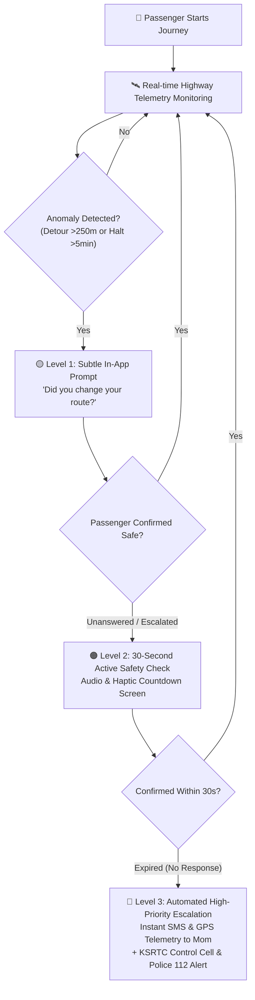

# 🛡️ NIGHTWATCH (ആനവണ്ടി)
### Proactive Late-Night Transit Safety Companion

[](https://anavandi--hackathon.vercel.app/)
[](https://anavandi--hackathon.vercel.app/)
[](https://anavandi--hackathon.vercel.app/)
[](https://anavandi--hackathon.vercel.app/)

> **"Your journey. Watched over."**  
> An intelligent, autonomous safety companion engineered for late-night commuters across Kerala’s public transport network.

---

## 🌐 Live Working Prototype
Experience the live application deployed on Vercel:  
👉 **[https://anavandi--hackathon.vercel.app/](https://anavandi--hackathon.vercel.app/)**

---

## 📌 Problem Statement (SC-03)

Late-night public transit across Kerala often leaves solitary commuters, women, shift workers, and students feeling vulnerable. 

### Why Traditional Emergency Apps Fail:
1. **Passive SOS Panic Buttons Are Unreliable**: In sudden danger, duress, or medical emergency, passengers cannot unlock their phones or press an SOS button in time.
2. **Undetected Highway Deviations**: Unscheduled route detours, isolated breakdowns, or prolonged unexpected halts along dark highways go unnoticed by family until it is too late.
3. **Connectivity Dead Zones**: Rural and hilly highway stretches often suffer cellular dropouts, disabling standard GPS streaming apps.
4. **The Last-Mile Dilemma**: The segment between disembarking at a KSRTC bus stand and walking home carries the highest risk.

---

## 💡 The Solution: Proactive vs. Reactive Safety

| Traditional Safety Apps (Reactive) | NIGHTWATCH (Proactive) |
| :--- | :--- |
| ❌ Waits for user to manually trigger emergency | ✅ Continuously evaluates journey telemetry against planned transit corridors |
| ❌ High rate of false alarms or forgotten check-ins | ✅ Intelligent 3-tier graduated anomaly detection engine |
| ❌ Requires loved ones to install bulky tracking apps | ✅ Zero-install companion web link with live satellite progress & battery level |
| ❌ Heavy battery drain and cloud GPS logging | ✅ Privacy-first edge processing with zero persistent cloud GPS tracking |

---

## 🚀 Key Innovations & Features

### 1. ⚡ 3-Tier Intelligent Escalation Engine
NIGHTWATCH employs an automated anomaly scoring algorithm evaluating:
- Route deviation distance ($> 250\text{ m}$)
- Unscheduled stationary duration ($> 5\text{ mins}$)
- Significant ETA delays ($> 15\text{ mins}$)
- High-risk transit hours ($10\text{ PM} - 5\text{ AM}$)
- Unresponsive passenger check-in timer



- **Level 1 · Soft Prompt**: Non-intrusive in-app banner for minor detours.
- **Level 2 · Active Safety Check**: 30-second audio and haptic countdown requiring conscious passenger check-in.
- **Level 3 · Emergency Escalation**: Dispatches high-priority alert with live coordinates to trusted contacts and the nearest KSRTC depot cell.

---

### 2. 🗺️ Kerala State Transit Dataset Integration (100+ Stations)
Integrated statewide public transport dataset covering all **14 Kerala districts**:
- **Comprehensive Depot Coverage**: Thampanoor Central, Vyttila Mobility Hub, Chinnakada, Kozhikode New Terminal, Kannur, Palakkad, and rural sub-depots.
- **State Highway Corridors**: Virtual geofencing along NH 66, MC Road, and state feeder highways.
- **Depot-Actionable Routing**: Safety alerts and route deviations are routed directly to jurisdictional KSRTC Station Masters and Central Control Room (`0471-2463799`).

---

### 3. 👥 Dual-Screen Live Ecosystem
- **Passenger App**:
  - Distraction-free native experience with high-contrast night appearance.
  - 1-tap route swapping, checkpoint milestones, and instant emergency SOS.
  - Native mobile-first design with pinned bottom navigation.
- **Trusted Companion View (Mom's Phone)**:
  - Accessible via secure, encrypted web link without requiring app installation.
  - Live satellite route map, ETA updates, checkpoint progression, and passenger battery/signal telemetry.

---

### 4. 🔒 Privacy-First Architecture & Offline Resilience
- **Edge Anomaly Computation**: Journey telemetry is evaluated on-device; raw GPS trails are never persistently stored on external servers.
- **SMS Telemetry Fallback**: If 4G/5G data drops in rural blind spots, critical coordinates and alert payloads format into lightweight cellular SMS packets.
- **Battery-Optimized Geofencing**: Adaptive GPS polling reduces battery consumption by up to 60% compared to typical continuous trackers.

---

## 🛠️ Technology Stack

- **Frontend Core**: React 19, TypeScript
- **Routing & Framework**: TanStack Router / TanStack Start
- **Styling & UI**: Tailwind CSS v4, Radix UI primitives, Lucide Icons
- **Interactive Mapping**: Leaflet, OpenStreetMap CartoDB Dark/Voyager tiles
- **State Management**: Reactive React state hooks with dynamic viewport adaptation
- **Deployment**: Vercel Edge Network

---

## 📱 User Experience: Phone & Desktop Optimized

- **Mobile View (`< 768px`)**: Designed as an app-native smartphone interface with a pinned 4-tab bottom navigation bar (`Home`, `History`, `Contacts`, `Settings`), full-viewport live tracking map, and instant theme toggling.
- **Web Dashboard (`≥ 768px`)**: Automatically expands into a widescreen two-column control portal (`max-w-7xl`) featuring high-resolution satellite transit telemetry, interactive Anomaly Engine diagnostics, and an official Kerala emergency directory.

---

## 🏃 Getting Started & Local Development

### Prerequisites
- Node.js (v18 or higher)
- npm or bun

### Installation

1. **Clone the repository**:
   ```sh
   git clone https://github.com/alwinjosegeorge/Anavandi-hackthon.git
   cd Anavandi-hackthon
   ```

2. **Install dependencies**:
   ```sh
   npm install
   ```

3. **Start development server**:
   ```sh
   npm run dev
   ```
   Open `http://localhost:5173` in your browser.

4. **Build for production**:
   ```sh
   npm run build
   ```

---

## 👥 Team
- **Alwin Jose George** (Lead & Full-Stack Development)
- **Team NIGHTWATCH** — ANAVANDI Hackathon 2026

---

## 📄 License
This project is developed for the **ANAVANDI Hackathon 2026** under the **Public Transport & Passenger Safety** track.
